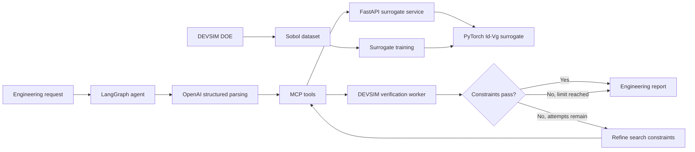

# Agentic MOSFET TCAD Design Optimization

An end-to-end semiconductor design workflow that combines physics-based DEVSIM simulation, Sobol design-of-experiments sampling, a PyTorch surrogate model, constrained optimization, FastAPI, MCP tools, and a LangGraph verification agent.

The system accepts a natural-language engineering objective, searches thousands of candidate MOSFET designs with the surrogate, verifies the best candidate using full TCAD transfer curves, and produces an auditable engineering report.

## Demonstrated capabilities

- Parameterized 2D MOSFET simulation with oxide, gate, bulk, source/drain, body, and halo doping
- Automated low- and high-drain-voltage I<sub>D</sub>–V<sub>G</sub> sweeps
- Extraction of V<sub>TH</sub>, I<sub>ON</sub>, I<sub>OFF</sub>, SS, DIBL, and I<sub>ON</sub>/I<sub>OFF</sub>
- Sobol-sampled TCAD dataset generation with resumable runs
- PyTorch surrogate prediction of complete transfer curves
- Validated FastAPI inference and constrained design optimization
- MCP tools for agent-accessible prediction, optimization, and TCAD verification
- LangGraph state management, conditional verification edges, constraint refinement, and bounded retries
- OpenAI structured requirement extraction and plain-English engineering reports
- Structured traces with redaction of API keys, secrets, and tokens

## Architecture



The FastAPI service remains independently deployable. The MCP server is a separate adapter that exposes API predictions and local TCAD verification to Cursor or another MCP client.

## Device and dataset

The surrogate training domain is:

| Parameter | Range |
| --- | ---: |
| Gate length | 40–60 nm |
| Oxide thickness | 1.0–1.5 nm |
| Halo peak doping | 1×10¹⁹–4×10¹⁹ cm⁻³ |
| Junction depth | 20–40 nm |
| Gate voltage | 0–1.2 V |
| Drain voltage | 0.05 V and 1.2 V |

The DOE requested 256 Sobol designs; 255 completed successfully. Device-level splitting prevents points from the same transfer curve from appearing in multiple data partitions:

- Training devices: 178
- Validation devices: 38
- Held-out test devices: 39
- Training points: 4,628
- Validation points: 988
- Test points: 1,014

## Surrogate model

The PyTorch MLP maps six scalar inputs to log₁₀(I<sub>D</sub>):

```text
Lg, tox, log10(halo doping), junction depth, Vg, Vd
    → 128 SiLU → 128 SiLU → 64 SiLU → log10(Id)
```

Held-out transfer-curve performance:

- Log-current R²: 0.99997
- Log-current MAE: 0.00586 decades
- Median absolute percentage error: 0.87%

Held-out engineering-metric performance:

| Metric | MAE | R² |
| --- | ---: | ---: |
| Threshold voltage | 6.39 mV | 0.985 |
| I<sub>ON</sub> | 6.39 µA/µm | 0.998 |
| log₁₀(I<sub>OFF</sub>) | 0.0122 decades | 0.9996 |
| Subthreshold slope | 0.427 mV/dec | 0.957 |
| DIBL | 2.52 mV/V | 0.901 |

## Runtime benchmark

For a 26-point pair of transfer curves on CPU:

| Execution mode | Time |
| --- | ---: |
| Warm surrogate inference | 0.080 ms |
| Model load and first inference | 2.42 ms |
| New-process cold start | 2.19 s |
| Mean DEVSIM simulation | 39.43 s |

The warm-model speedup is approximately 4.9×10⁵. Cold-process speedup is approximately 18×. These figures apply to this machine, model, sweep, and simulator configuration.

## Verified optimization example

Objective:

```text
Maximize Ion with Ioff below 1 nA/µm,
SS below 85 mV/dec, and DIBL below 50 mV/V.
```

The surrogate evaluated 4,096 candidates and found 741 feasible designs. Its highest-I<sub>ON</sub> candidate was:

- Gate length: 41.88 nm
- Oxide thickness: 1.15 nm
- Halo peak doping: 3.95×10¹⁹ cm⁻³
- Junction depth: 24.21 nm

| Metric | Surrogate | DEVSIM | Verification |
| --- | ---: | ---: | --- |
| I<sub>ON</sub> | 822.4 µA/µm | 830.4 µA/µm | Pass |
| I<sub>OFF</sub> | 0.820 nA/µm | 0.817 nA/µm | Pass |
| SS | 80.36 mV/dec | 80.47 mV/dec | Pass |
| DIBL | 48.00 mV/V | 43.86 mV/V | Pass |

All requested constraints passed full DEVSIM verification.


The readable decision report is available at `agent_runs/design_agent_20260726T202654Z/report.md`.

## Main components

| File | Responsibility |
| --- | --- |
| `mos_2d_model.py` | Device parameters, geometry, mesh, and doping profiles |
| `mos_2d.py` | Parameterized DEVSIM Poisson and drift-diffusion solve |
| `generate_dataset.py` | Cartesian/Sobol DOE execution, resume support, and metric extraction |
| `train_idvg_surrogate.py` | Device-level data splitting and PyTorch model training |
| `evaluate_idvg_surrogate.py` | Curve/metric validation and runtime benchmarks |
| `surrogate_inference.py` | Reusable warm-loaded inference engine and domain checks |
| `surrogate_api.py` | FastAPI prediction and optimization endpoints |
| `design_optimizer.py` | Sobol candidate search with engineering constraints |
| `tcad_mcp_server.py` | MCP adapter and isolated DEVSIM verification worker |
| `verify_design_with_tcad.py` | Surrogate-versus-TCAD curve and metric validation |
| `design_agent.py` | LangGraph optimization, verification, retry, and reporting workflow |

## Running locally

The project currently targets Windows and Python 3.11. DEVSIM requires a compatible BLAS/LAPACK runtime. The project activation script configures the existing environment to use `mkl_rt.3.dll`.

### 1. Activate the environment

```powershell
.\activate.ps1
```

### 2. Preview or generate the Sobol dataset

```powershell
python generate_dataset.py --config sobol_config.json
python generate_dataset.py --config sobol_config.json --run
```

Completed cases are detected from their metadata, so an interrupted DOE can resume.

### 3. Train and evaluate the surrogate

```powershell
python train_idvg_surrogate.py
python evaluate_idvg_surrogate.py
```

### 4. Start the surrogate API

```powershell
python -m uvicorn surrogate_api:app --host 127.0.0.1 --port 8000
```

Interactive API documentation:

```text
http://127.0.0.1:8000/docs
```

### 5. Configure the OpenAI key

Create `.env` locally:

```dotenv
OPENAI_API_KEY=your-key-here
OPENAI_MODEL=gpt-4.1-mini
```

`.env` is excluded from version control. Never commit API keys.

### 6. Run the full agent

Keep the FastAPI service running, then use another activated terminal:

```powershell
python design_agent.py "Maximize Ion with Ioff below 1 nA/um, SS below 85 mV/dec, and DIBL below 50 mV/V"
```

Each run produces:

```text
agent_runs/design_agent_<timestamp>/
├── trace.jsonl
├── result.json
└── report.md
```

Each TCAD verification produces curves, a plot, a structured report, and a live verification log under `verification/<run_id>/`.

## MCP integration

`.cursor/mcp.json` registers `tcad_mcp_server.py` as a local stdio server. Available tools:

- `check_api_health`
- `get_valid_design_ranges`
- `predict_device_metrics`
- `predict_idvg_curves`
- `optimize_device_design`
- `verify_design_with_tcad`

The verification worker explicitly isolates stdin and file descriptors so DEVSIM output cannot interfere with MCP JSON-RPC transport.

## Testing

Run the API and LangGraph unit tests:

```powershell
python -m pytest test_surrogate_api.py test_design_agent.py -q
```

Run the API/MCP integration smoke test:

```powershell
python smoke_test_mcp_server.py
```

The agent tests mock external services and cover:

- Successful verification
- Failed verification followed by constraint refinement and retry
- Maximum retry termination
- No feasible surrogate design
- TCAD timeout reporting
- OpenAI parsing failure

`.github/workflows/tests.yml` repeats the syntax checks and 12 tests on every GitHub push and pull request using Python 3.11 and CPU-only PyTorch. It does not run DEVSIM, require an OpenAI key, or make paid API calls.

## Traceability and safety

- The surrogate rejects out-of-domain requests unless extrapolation is explicitly enabled.
- Final engineering decisions require DEVSIM verification.
- Agent retries are bounded.
- OpenAI inputs/outputs, MCP calls, graph routes, and errors are recorded in JSONL traces.
- Keys, tokens, and secrets are redacted from traces.
- DEVSIM runs in an isolated subprocess so numerical-library output cannot corrupt MCP transport.

## Limitations

This is a research and portfolio workflow, not a calibrated foundry process model. The current device uses idealized geometry and doping profiles with scaled constant mobility. It does not include a calibrated process deck, quantum confinement, self-heating, complete high-field mobility physics, statistical process variation, or silicon measurement correlation. Results should be interpreted only inside the documented design domain.

## Next engineering steps

- Initialize and publish the Git repository to activate GitHub Actions
- Deploy the FastAPI service to a managed Python platform
- Add API authentication, rate limiting, and production observability
- Expand the DOE around high-error and constraint-boundary regions
- Calibrate transport and geometry against published or measured devices
